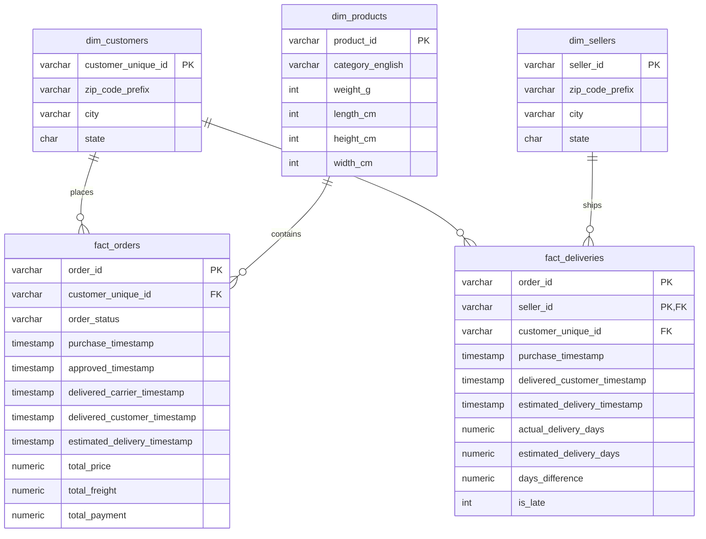

# Olist Marketplace Intelligence Platform
### *End-to-End Analytics & Decision-Support System for E-Commerce Operations*

🌟 **Live Streamlit Dashboard:** [https://ecommerce-intelligence-platform-luombiaprr2bxivvpxewoc.streamlit.app](https://ecommerce-intelligence-platform-luombiaprr2bxivvpxewoc.streamlit.app)

---

## 🚀 Business Value & Key Insights Discovered
This project is built around **the only rule that matters**: *If removing a chart doesn't change any decision, the chart should not exist.* Instead of generic charts, this platform uncovers actionable operational and customer bottlenecks:

### 1. The Logistics Failure ➔ Customer Satisfaction Link (Operations View)
* **Logistics Bottleneck**: In **March 2018**, the late delivery rate peaked at **21.15%** (over 1 in 5 orders were late), with average delivery times climbing to **16.2 days**.
* **Customer Backlash**: Concurrently, the **Average Review Score fell to 3.75/5** (compared to the usual average of 4.25). This proves delivery speed is the primary driver of customer satisfaction.

### 2. Low Retention / The "Leaky Bucket" (Marketing View)
* **Brutal Churn**: Cohort analysis revealed Olist's **Month 1 retention rate is under 0.5%** (only 3 out of 752 customers returned in January 2017).
* **The Opportunity**: However, **repeat buyers spend 2x more per transaction** than first-time buyers (`Champions` AOV = **357 BRL** vs `New/Recent` AOV = **161 BRL**).
* **Decision Enabled**: The VP of Marketing must shift budget from expensive acquisition to customer loyalty programs.

### 3. Route Delays: Carrier vs. Seller Delays (Operations View)
* **SP ➔ AL Route**: **25.28% late rate**. Delayed orders are caused by the **Carrier (88.06% of faults)**, not the sellers.
* **MA ➔ SP Route**: **24.80% late rate**. Delayed orders are caused by **Slow Sellers (87.10% of faults)** taking too long to ship.
* **Decision Enabled**: Replace the carrier on the SP-AL route; penalize/educate slow-shipping sellers in Maranhão (MA).

---

## 🏗️ Architecture & Data Pipeline
This platform utilizes a **SQL-first ELT (Extract-Load-Transform)** approach. Raw CSV data is loaded into PostgreSQL with loose constraints to prevent ingestion crashes, then fully cleaned and modeled inside the database.

```
[ Raw CSV Files ] 
       │ (Thin Python Ingestion Loader)
       ▼
[ Raw Schema (PostgreSQL) ]
       │ (SQL DDL/DML Transformations with casting & COALESCE)
       ▼
[ Star Schema Dimensional Model (PostgreSQL) ]
       │ (SQL Window Functions & Analytical Queries)
       ▼
[ JSON Exporter ] ➔ [ Zero-Dependency HTML5 Premium Dark Dashboard ]
```

---

## 📊 Dimensional Data Model (Star Schema)

The core transaction metrics are separated into standard dimensions and focused fact tables:



---

## 💻 Tech Stack
* **Database**: PostgreSQL (Structured modeling, indexes, and window functions)
* **Pipeline**: Python (psycopg2 for high-speed `COPY` bulk ingestion)
* **Frontend**: HTML5, Vanilla CSS (Premium Glassmorphism Dark Theme), Chart.js (Data visualizations)

---

## 🛠️ How to Run Locally

### Prerequisites
* Python 3.8+
* PostgreSQL running locally

### 1. Ingest Raw CSVs into PostgreSQL
Rename `.env.example` to `.env` and fill in your PostgreSQL credentials, then run:
```bash
source .venv/bin/activate
pip install -r requirements.txt
python src/load_data.py
```

### 2. Clean Data & Build Star Schema
Execute the SQL files inside `sql/` in order:
```bash
# Clean up missing translations & column BOMs
PGPASSWORD=your_password psql -U postgres -h localhost -d olist_marketplace -f sql/03_cleaning/clean_translations.sql

# Build dimensional tables & fact tables
PGPASSWORD=your_password psql -U postgres -h localhost -d olist_marketplace -f sql/04_star_schema/dim_products.sql
PGPASSWORD=your_password psql -U postgres -h localhost -d olist_marketplace -f sql/04_star_schema/dim_customers.sql
PGPASSWORD=your_password psql -U postgres -h localhost -d olist_marketplace -f sql/04_star_schema/dim_sellers.sql
PGPASSWORD=your_password psql -U postgres -h localhost -d olist_marketplace -f sql/04_star_schema/fact_orders.sql
PGPASSWORD=your_password psql -U postgres -h localhost -d olist_marketplace -f sql/04_star_schema/fact_deliveries.sql
```

### 3. Generate Analytical Views & Export JSON
Create the analytical views and run the Python exporter:
```bash
# Create analytical views
PGPASSWORD=your_password psql -U postgres -h localhost -d olist_marketplace -f sql/05_kpis/ceo_kpis.sql
PGPASSWORD=your_password psql -U postgres -h localhost -d olist_marketplace -f sql/05_kpis/ops_kpis.sql
PGPASSWORD=your_password psql -U postgres -h localhost -d olist_marketplace -f sql/05_kpis/marketing_kpis.sql
PGPASSWORD=your_password psql -U postgres -h localhost -d olist_marketplace -f sql/06_analytics/rfm_segmentation.sql
PGPASSWORD=your_password psql -U postgres -h localhost -d olist_marketplace -f sql/06_analytics/cohort_retention.sql
PGPASSWORD=your_password psql -U postgres -h localhost -d olist_marketplace -f sql/06_analytics/delivery_root_cause.sql
PGPASSWORD=your_password psql -U postgres -h localhost -d olist_marketplace -f sql/06_analytics/time_patterns.sql

# Export views to JSON
python src/export_data.py
```

### 4. Start the Dashboard
Navigate to the `dashboard/` directory and spin up a lightweight server:
```bash
cd dashboard
python3 -m http.server 8000
```
Open **[http://localhost:8000](http://localhost:8000)** in your browser!
