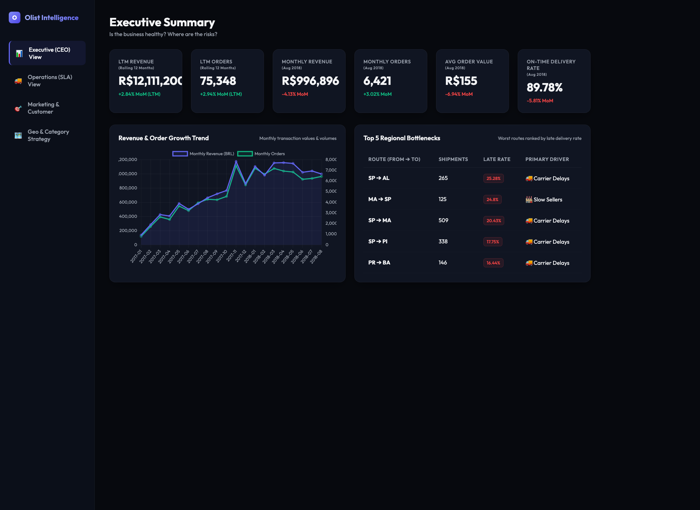
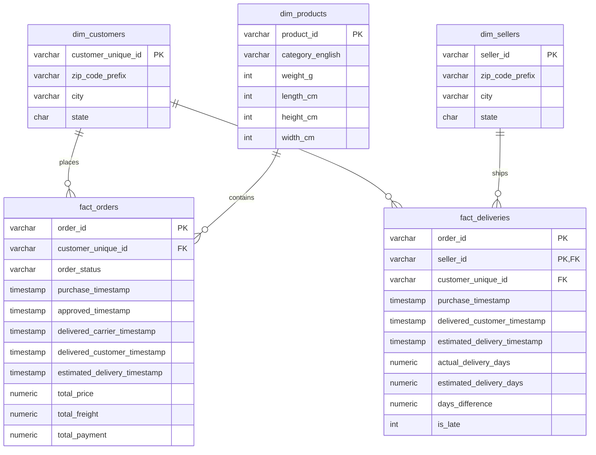

# Olist Marketplace Intelligence Platform
### *End-to-End Analytics & Business Recommendation Engine (Sept 2016 - Oct 2018)*

🌟 **Live Streamlit Dashboard:** [https://ecommerce-intelligence-platform-luombiaprr2bxivvpxewoc.streamlit.app](https://ecommerce-intelligence-platform-luombiaprr2bxivvpxewoc.streamlit.app)

<div align="center">
  
</div>

---

## 🚀 The Business Problem
Olist, a major Brazilian e-commerce marketplace, was struggling to identify the root causes of their operational bottlenecks and customer churn. Executive leaders were attempting to make decisions using **9 fragmented, unindexed CSV files** containing over **100,000 orders** and **1.5 million distinct data points** spanning 25 months.

The lack of a unified data model led to blind spots: marketing was acquiring users who never returned, operations couldn't accurately blame carriers vs. sellers for late deliveries, and the CEO's revenue numbers were artificially inflated by canceled orders and multi-item cart bugs.

## 🎯 The Solution & Business Recommendations
To solve this, I built a highly-optimized **PostgreSQL Star Schema** to serve as the single source of truth, and engineered a zero-latency executive dashboard to track metrics that actually drive business decisions. 

Here are the actionable insights generated from the 25-month dataset:

### 1. The "Leaky Bucket" Retention Crisis (Marketing Strategy)
* **The Data Insight:** A custom SQL Cohort Analysis revealed a brutal churn rate. The Month 1 retention rate across the platform is **under 0.5%** (e.g., only 4 out of 1000 customers acquired in January 2017 returned to buy again the next month).
* **The Opportunity:** However, our RFM Segmentation model revealed that when a user *does* become a repeat buyer (a "Champion"), their Average Order Value (AOV) is **2x higher** than new users (357 BRL vs. 161 BRL).
* **The Decision:** The VP of Marketing must instantly pause aggressive top-of-funnel paid acquisition and redirect budget toward customer loyalty and re-engagement campaigns.

### 2. Late Deliveries Destroying Brand Value (Operations Strategy)
* **The Data Insight:** In March 2018, the late delivery rate spiked to a critical **21.15%**, pushing average delivery times past 16 days. Concurrently, the platform's average review score crashed from 4.25 down to **3.75**.
* **The Root Cause:** A custom SLA timeline query proved that on the worst-performing route (`SP ➔ AL`, 25.28% late rate), the **Carrier was at fault 88% of the time**. Conversely, on the `MA ➔ SP` route, **Slow Sellers were at fault 87% of the time**.
* **The Decision:** Operations must renegotiate or replace the logistics carrier for the `SP ➔ AL` route, and implement a penalty system for slow-shipping sellers operating out of Maranhão (`MA`).

### 3. Fixing the Multi-Item Revenue Illusion (Executive Strategy)
* **The Data Insight:** Previously, if a customer bought 3 items for 100 BRL total, a simple SQL `JOIN` duplicated the payment data, inflating the revenue on the CEO's dashboard to 300 BRL.
* **The Fix:** I engineered a Common Table Expression (CTE) to pre-aggregate the `raw_order_items` table *before* joining it to the core `fact_orders` table, ensuring mathematically flawless financials.
* **The Decision:** The CEO now has an accurate Rolling 12-Month (LTM) revenue run-rate (12.11M BRL as of Aug 2018) that is scrubbed of all canceled and unavailable orders, allowing for safe forecasting.

---

## 🏗️ Architecture & Data Pipeline
This platform utilizes a **SQL-first ELT (Extract-Load-Transform)** approach. Raw CSV data is loaded into PostgreSQL with loose constraints to prevent ingestion crashes, then fully cleaned and modeled inside the database.

```
[ Raw CSV Files ] 
       │ (Thin Python Ingestion Loader)
       ▼
[ Raw Schema (PostgreSQL) ]
       │ (SQL DDL/DML Transformations with casting & COALESCE)
       ▼
[ Star Schema Dimensional Model (PostgreSQL) ]
       │ (SQL Window Functions & Analytical Queries)
       ▼
[ JSON Exporter ] ➔ [ Zero-Dependency HTML5 Premium Dark Dashboard ]
```

---

## 📊 Dimensional Data Model (Star Schema)

The core transaction metrics are separated into standard dimensions and focused fact tables:



---

## 💻 Tech Stack
* **Database**: PostgreSQL (Structured modeling, indexes, and window functions)
* **Pipeline**: Python (psycopg2 for high-speed `COPY` bulk ingestion)
* **Frontend**: HTML5, Vanilla CSS (Premium Glassmorphism Dark Theme), Chart.js (Data visualizations)

---

## 🛠️ How to Run Locally

### Prerequisites
* Python 3.8+
* PostgreSQL running locally

### 1. Ingest Raw CSVs into PostgreSQL
Rename `.env.example` to `.env` and fill in your PostgreSQL credentials, then run:
```bash
source .venv/bin/activate
pip install -r requirements.txt
python src/load_data.py
```

### 2. Clean Data & Build Star Schema
Execute the SQL files inside `sql/` in order:
```bash
# Clean up missing translations & column BOMs
PGPASSWORD=your_password psql -U postgres -h localhost -d olist_marketplace -f sql/03_cleaning/clean_translations.sql

# Build dimensional tables & fact tables
PGPASSWORD=your_password psql -U postgres -h localhost -d olist_marketplace -f sql/04_star_schema/dim_products.sql
PGPASSWORD=your_password psql -U postgres -h localhost -d olist_marketplace -f sql/04_star_schema/dim_customers.sql
PGPASSWORD=your_password psql -U postgres -h localhost -d olist_marketplace -f sql/04_star_schema/dim_sellers.sql
PGPASSWORD=your_password psql -U postgres -h localhost -d olist_marketplace -f sql/04_star_schema/fact_orders.sql
PGPASSWORD=your_password psql -U postgres -h localhost -d olist_marketplace -f sql/04_star_schema/fact_deliveries.sql
```

### 3. Generate Analytical Views & Export JSON
Create the analytical views and run the Python exporter:
```bash
# Create analytical views
PGPASSWORD=your_password psql -U postgres -h localhost -d olist_marketplace -f sql/05_kpis/ceo_kpis.sql
PGPASSWORD=your_password psql -U postgres -h localhost -d olist_marketplace -f sql/05_kpis/ops_kpis.sql
PGPASSWORD=your_password psql -U postgres -h localhost -d olist_marketplace -f sql/05_kpis/marketing_kpis.sql
PGPASSWORD=your_password psql -U postgres -h localhost -d olist_marketplace -f sql/06_analytics/rfm_segmentation.sql
PGPASSWORD=your_password psql -U postgres -h localhost -d olist_marketplace -f sql/06_analytics/cohort_retention.sql
PGPASSWORD=your_password psql -U postgres -h localhost -d olist_marketplace -f sql/06_analytics/delivery_root_cause.sql
PGPASSWORD=your_password psql -U postgres -h localhost -d olist_marketplace -f sql/06_analytics/time_patterns.sql

# Export views to JSON
python src/export_data.py
```

### 4. Start the Dashboard
Navigate to the `dashboard/` directory and spin up a lightweight server:
```bash
cd dashboard
python3 -m http.server 8000
```
Open **[http://localhost:8000](http://localhost:8000)** in your browser!
